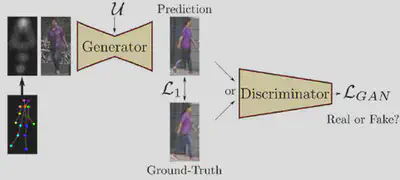
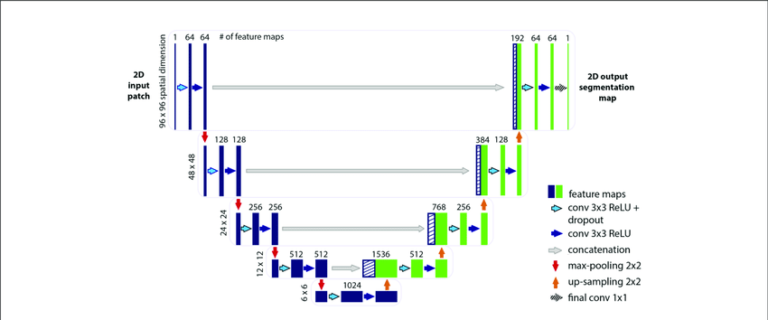
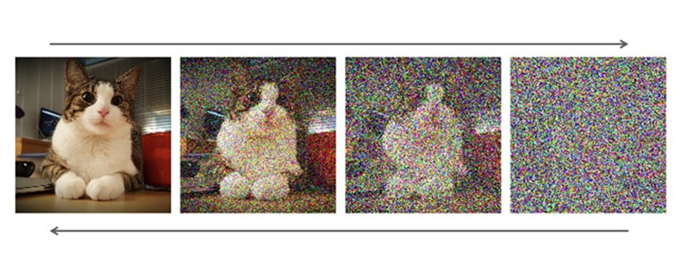
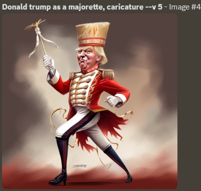
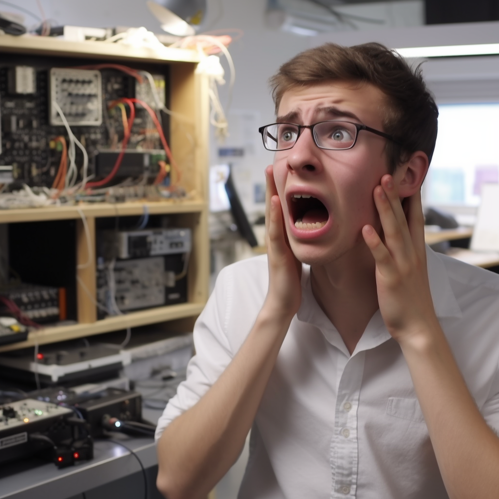

# Introduction Générale 

La capacité des IA à générer des images a récemment touché le grand public. Les résultats incroyablement réalistes de Midjourney, Stable Diffusion et plus récemment Dall-E ont interessé de nombreuses personnes qui se sont mis à la génération d'image.

Ces IA sont désormais capables de bien sûr générer des images, mais également de modifier des images à l'aide d'un prompt, de les agrandir, de les détailler, de les étendre ou d'en recopier le style.

Ces avancées ont permis à certains artistes de modifier leurs façons de faire. Au lieu de créer d'eux-même une image complète, ils génèrent une image et en corrige ensuite les imperfections. D'autres utilise les images générées comme source d'inspiration, allant même jusqu'à créer des bandes-dessinnés entières faîtes d'image d'IA mais accompagnés de textes fait par l'artiste.

Les générateurs d'images ne touchent cependant pas que les artistes, bien que ceux-ci soient les premiers concernés par les IA génératrices. Les particuliers ont vite pris d'assaut les générateurs comme Stable Diffusion et Midjourney, qui fonctionnent sur le modèle du freemium et laisse les utilisateurs utiliser une partie des capacités de leur algorithme gratuitement afin d'allécher les utilisateurs.

# Historique & Technique

## Réseaux de neurones adversaires

C'est en 2014 que sont inventé les premiers réseaux de neurones adversaires, plus couramment appelé GAN. C'est un paradigme de réseaux de neurones, où deux réseaux sont en compétition l'un contre l'autre. Le générateur cherche à créer une image ressemblant à la réalité alors que le discriminateur cherche à distinguer l'image générée d'une autre d'une base de données. Les deux réseaux vont ainsi apprendre ensemble jusqu'à ce que le générateur ai atteint un stade satisfaisant. Il peut alors générer des images ressemblant à celle de la base de données.

>On peut notamment citer comme exemple de GAN le réseaux utilisé pour le site [this person does not exist](this-person-does-not-exist.com). Chaque minute, une nouvelle image ressemblant à une photo de personne est générée et affichée sur le site. Bien que des aberrations apparaissent parfois, elles sont généralement très convaincantes. 

Il faut cependant voir une des limitations de cette technologie : il n'est pas possible de demander une image respectant certains critères en particulier. Les images sont à la fois aléatoires et ne peuvent pas représenter quelque chose d'autre que le thème de la base de données du discriminateur.

## Diffusion stable

La diffusion stable est le nom d'une fusion de deux techniques qui a permis aux IAs d'émerger ces derniers mois. 

Elle utilise les espaces latents, qui sont utilisés dans les modèles du languages pour transformer en vecteur des mots ou des phrases. Une fois placé dans ces espaces de haute dimension, des expressions a priori proches par le sens mais éloignées par l'orthographe vont se retrouver proches. Cela permet de traiter le prompt de l'IA.

Pour ce qui est de la génération d'image, on utilise des réseaux dit "U-net" à cause de leur forme. Ces réseaux sont spécialisés dans le traitement d'image. Ils sont composés de couches successives de convolution qui accummulent de plus en plus une compréhension globale plutôt que locale de l'image jusqu'au niveau le plus bas du U, puis de déconvolution qui permettent de donner forme à ces images.

On entraîne ces réseaux à débruiter des images. Si on les entraîne sur un type d'image en particulier, il a été constaté qu'ils peuvent "halluciner" des images là où on ne leur avait fourni que du bruit, comme on peut le voir sur l'image suivante :

Pour pouvoir générer des images correspondant à un prompt, on les fait s'entraîner en prenant en entrée non pas juste l'image à débruiter mais également l'espace latent du prompt, donné par un modèle de language. Cela demande simplement des bases de données énormes pour avoir une IA capable de tout représenter.

## Prompt Engineering

Avec la naissance des IAs génératives à base de prompt est venu l'optimisation de ces prompts. 

Certains proposent leurs services pour réaliser des prompts particulièrement efficaces. Connaître le modèle et certaines de ses particularités permet de parfois de contourner les garde-fous mis en place par les entreprises commercialisant l'IA. Certains, à force de test, parviennent à générer du contenu pornographique en évitant la liste de mot et d'expression bannis sur les générateurs d'images. Sur les générateurs de textes comme chatGPT, cela est certainement plus utiles pour lui poser des questions sur des thèmes interdit par OpenAI. 

Il est déjà possible de vendre sur quelques sites des prompts ou des mot-clés particulièrement efficace pour générer des images réalistes et belles. Bien que cette tendance à vouloir "apprendre le modèle" pour l'utiliser au mieux soit encore populaire, des spécialistes des modèles du language prédisent que ce ne sera pas durable. Ils montrent l'évolution de la compréhension des modèles, d'une version plus récente de Midjourney à l'autre, comme une preuve que ce métier va disparaitre aussi vite qu'il est venu.

# Éthique & Aspects légaux

## Pourquoi y a-t-il un problème ?

Les images générées posent plusieurs problèmes. 

Premièrement, les images utilisées pour l'entrainement ne sont pas libre de droit. Il est après entraînement impossible de dire quelles images ont été utilisées. Le réseau de neurones agit comme une façon de les mémoriser sans les stocker explicitement, ce qui est difficile à gérer légalement. 

Les IA peuvent également générer des images qui sont exactement semblables à des oeuvres originales d'artistes, ou copier leurs styles à volonté. C'est évidemment problèmatique pour les artistes qui ont le sentiment de se faire remplacer par des machines, et perdent ainsi leur travail. L'IA peut aisément contrefaire le travail des artistes, que ce soit pour imiter leur style, ou pour effectuer des contrefaçons. Les deux images ci-dessous, l'une de Mucha, un fameux artiste art déco du XXème siècle, et l'autre de Midjourney répondant à un prompt demandant d'imiter le style de Mucha, en sont un exemple flagrant.

Enfin, il est devenu facile de générer de remplacer un visage dans une vidéo. Cela a lancé les deepfakes, qui ont très vite connu un succès dans deux secteurs: la désinformation et la pornographie. Il est extrêmement simple de demander à une IA une caricature ou une position embarassante d'une personnalité connue. Je vous laisse découvrir Trump en majorette, par Midjourney.

## La réaction des artistes

Plusieurs collectifs d'artistes ont saisi la justice pour lutter pour leurs droits aux copyright et à l'abus des générateurs d'images.

C'est à San Fransisco que le premier collectif d'artiste a porté plainte, pour enfrainte du copyright et pratiques anticoncurrentielles. Ils ont attaqué en justice Midjourney, DreamUp et Stabilty mais étonnament pas Dall-E.

Du point de vue des artistes, les IAs permettent de vendre des images dérivées de leurs oeuvres sans leur verser d'argent du copyright. 

## Évolution légale

Plusieurs évolutions ont déjà eu lieu. 

Au États-Unis, des procès contre les générateurs d'images ont été lancés. Ils permettront d'éclaircir la zone grise du copyright dans lequel sont les IA actuellement, et sans doute de sanctionner Dall-E, midjourney et les autres générateurs pour leur usages abusifs des images.

En Europe, des lois doivent être débattues au parlement européen en tant qu'EU AI Act. Elles ont pour but de devancer les futurs abus en donnant un cadre légal aux réseaux de neurones et à leur utilisation, ainsi que notamment à leurs abus comme la création d'image à caractère pornographique.

# The End

student terrified by his project "veille technologique", by Midjourney

